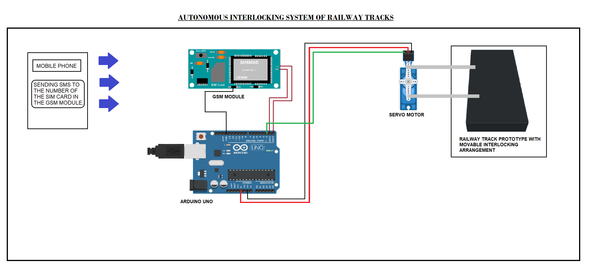

# Autonomous-Interlocking-System--Arduino-Project-

• A I.O.T. based prototype to demonstrate wireless controlled
Interlocking System of Railway tracks.

• It can be used in a larger scale to prevent various hazzards.

• The app has customizable speed range and data values to
manipulate and make the visualization process more interactive.

• An Arduino along with a GSM Module is used to establish the
wireless connection using mobile SMS

• A servo motor is used to replicate the motion of interlocking
tracks
